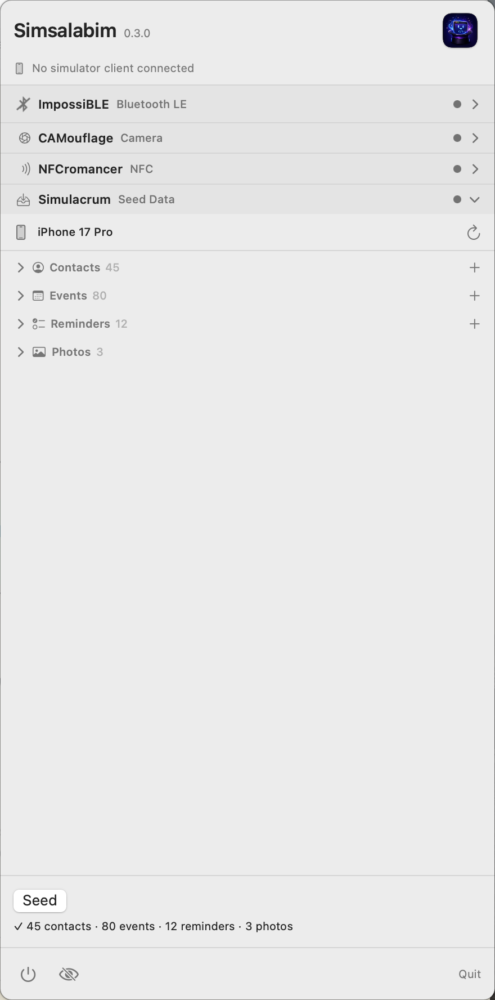

<p align="center">
  
</p>

# Simsalabim

**Magically unlock hardware powers in the iOS Simulator.**

Simsalabim is the suite app over the simulator-retrofitting products — one
menu bar item, one panel, every provider:

- **[ImpossiBLE](https://github.com/mickeyl/ImpossiBLE)** — real or mock
  Bluetooth LE for `CoreBluetooth` apps
- **[CAMouflage](https://github.com/mickeyl/CAMouflage)** — real or mock
  cameras for `AVFoundation` capture apps
- **[NFCromancer](https://github.com/mickeyl/NFCromancer)** — real or mock
  NFC tags for `CoreNFC` apps
- **[Simulacrum](https://github.com/mickeyl/Simulacrum)** — seeds real
  Contacts/Calendar/Reminders/Photos data into a booted simulator, one click

<p align="center">
  
</p>

Each product remains an individually installable, self-contained tool with its
own standalone menu bar app; Simsalabim embeds the very same provider
libraries (`ImpossiBLEProviderKit`, `CAMouflageProviderKit`,
`NFCromancerProviderKit`, `SimulacrumProviderKit`) side by side. The iOS-side
integration is unchanged — your simulator app links either the single
`SimsalabimClient` umbrella or the individual product libraries and cannot tell
which host app is serving.

## How it works

The panel stacks one section per provider. ImpossiBLE, CAMouflage, and
NFCromancer each have their own Off / Mock / Passthrough selection — BLE
passthrough alongside camera mock is a perfectly normal combination.
Simulacrum is different in kind: there's no mode to switch, just a fixture
editor and a "Seed" button that writes real data into whichever simulator is
currently booted. The panel is an exclusive accordion: every module keeps its
header — with a live status dot — always visible, and exactly one module is
expanded at a time, taking the full pane, the same room its standalone app
would offer. (An earlier layout divided the panel between multiple expanded
modules with a drag splitter; the history and the performance lessons behind
abandoning that live in AGENTS.md.) The menu
bar icon shows the live state of every active passthrough/mock module: the
wand is the brand anchor, and each one contributes its own glyph in its
product's state language (dot-badged when mocking, plain when forwarding,
flashing on traffic) — Simulacrum has no ongoing "on" state, so it doesn't
add to the composite icon; its panel section is the only place it shows up.

Each module keeps its own socket (`/tmp/impossible.sock`,
`/tmp/camouflage.sock` plus the frame socket, `/tmp/nfcromancer.sock`,
`/tmp/simulacrum.sock`), so simulator libraries cannot tell the suite from
the standalone apps. The shared foundation —
[SimBridgeKit](https://github.com/mickeyl/SimBridgeKit) — brings the
socket-ownership guard: whichever app (standalone or suite) binds a provider
socket first keeps it, and the other shows **Blocked** instead of silently
stealing it.

## Integrating your iOS app

Add this repository as a Swift Package dependency to the app you want to run
in the iOS Simulator. The umbrella product is available starting with
Simsalabim 0.6.0:

```swift
dependencies: [
    .package(
        url: "https://github.com/mickeyl/Simsalabim.git",
        from: "0.6.0"
    ),
]
```

Then add the **`SimsalabimClient`** library product to your app target. In
Xcode, use **File → Add Package Dependencies…**, enter the repository URL, and
select `SimsalabimClient` when Xcode asks which product to add.

The product links all three transparent simulator bridges in one step:
`ImpossiBLE`, `CAMouflage`, and `NFCromancer`. No changes to your
CoreBluetooth, AVFoundation, or CoreNFC code are required. Run Simsalabim on
the Mac, select each provider's mode in the panel, and launch your app in the
iOS Simulator. Device builds keep using Apple's real frameworks; the bridge
implementations become no-ops there.

Importing the umbrella module is only necessary when you use the optional
test-fixture APIs directly:

```swift
import SimsalabimClient

let bleReady = ImpossiBLEIsProviderConnected()
let cameraReady = CAMouflageIsProviderConnected()
let nfcReady = NFCromancerIsProviderConnected()
```

`Simulacrum` is not part of this linked product: its normal contact, calendar,
reminder, and photo seeding is driven entirely from the Mac app or the
`simsalabim` CLI and requires no dependency in the app under test.

## Quick Start

```bash
git clone --recursive https://github.com/mickeyl/Simsalabim.git
cd Simsalabim
make run
```

(Forgot `--recursive`? `make bootstrap` fetches the product submodules.)

Select the modes you need in the panel. On first Passthrough use, macOS will
prompt for Bluetooth and/or camera access; NFC passthrough requires a USB
ACR122U reader. Simulacrum needs no setup — with a simulator booted, click
"Seed" in its section.

## Headless CLI

`simsalabim` drives a running Simsalabim.app from the command line — live
mode switches, status queries, and simulator seeding — for scripting and CI:

```bash
make cli-install   # installs to ~/.local/bin, plus its man page
simsalabim status
simsalabim mode impossible passthrough --launch
simsalabim seed --contacts --calendar
```

Full reference: `man simsalabim`.

## Building blocks

```
Simsalabim package (this repo)
  ├── SimsalabimClient  (one iOS product)
  │   ├── ImpossiBLE
  │   ├── CAMouflage
  │   └── NFCromancer
  └── Simsalabim.app    (suite shell, one macOS status item)
      ├── ImpossiBLEProviderKit
      ├── CAMouflageProviderKit
      ├── NFCromancerProviderKit
      ├── SimulacrumProviderKit
      └── SimBridgeKit  (transport + menu bar shell)
```

The product repositories are Git submodules. Their pins record exactly which
client and provider versions a Simsalabim release ships; `make check-pins`
verifies they are reachable on each product's `origin/master`.

## Requirements

- macOS 15+ with Bluetooth hardware (for BLE passthrough), a camera (for
  camera passthrough), and/or a USB ACR122U reader (for NFC passthrough)
- Xcode 16+ (Swift Package Manager)

## License

MIT — see [LICENSE](LICENSE) for details.
