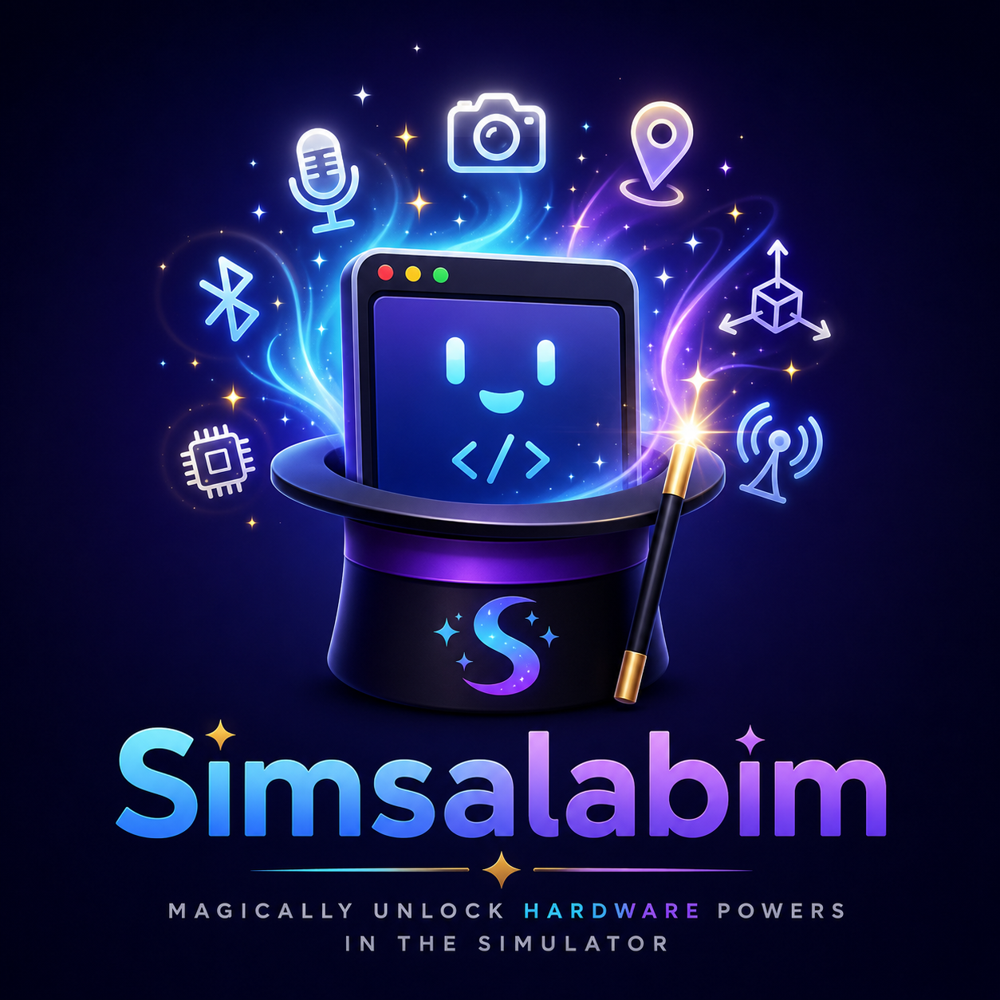

<p align="center">
  
</p>

# Simsalabim

**Magically unlock hardware powers in the iOS Simulator.**

Simsalabim is the suite app over the simulator-retrofitting products — one
menu bar item, one panel, every provider:

- **[ImpossiBLE](https://github.com/mickeyl/ImpossiBLE)** — real or mock
  Bluetooth LE for `CoreBluetooth` apps
- **[CAMouflage](https://github.com/mickeyl/CAMouflage)** — real or mock
  cameras for `AVFoundation` capture apps
- **[NFCromancer](https://github.com/mickeyl/NFCromancer)** — real or mock
  NFC tags for `CoreNFC` apps

Each product remains an individually installable, self-contained tool with its
own standalone menu bar app; Simsalabim embeds the very same provider
libraries (`ImpossiBLEProviderKit`, `CAMouflageProviderKit`,
`NFCromancerProviderKit`) side by side. The iOS-side integration is unchanged
— your simulator app links the product library it needs and cannot tell which
host app is serving.

## How it works

The panel stacks one section per provider, each with its own
Off / Mock / Passthrough selection — BLE passthrough alongside camera mock is
a perfectly normal combination. Sections collapse to their header, and a
splitter divides the space between expanded modules. The splitter deliberately
uses *delayed resize*: while dragging, only the grip travels and the panes
snap once on release — live-resizing the sections' scrollable lists at
mouse-event rate stutters badly on macOS (details in AGENTS.md). The menu bar icon shows the live state of
every active module: the wand is the brand anchor, and each module that is
switched on contributes its own glyph in its product's state language
(dot-badged when mocking, plain when forwarding, flashing on traffic).

Each module keeps its own socket (`/tmp/impossible.sock`,
`/tmp/camouflage.sock` plus the frame socket, `/tmp/nfcromancer.sock`), so
simulator libraries cannot tell the suite from the standalone apps. The
shared foundation —
[SimBridgeKit](https://github.com/mickeyl/SimBridgeKit) — brings the
socket-ownership guard: whichever app (standalone or suite) binds a provider
socket first keeps it, and the other shows **Blocked** instead of silently
stealing it.

## Quick Start

```bash
git clone --recursive https://github.com/mickeyl/Simsalabim.git
cd Simsalabim
make run
```

(Forgot `--recursive`? `make bootstrap` fetches the product submodules.)

Select the modes you need in the panel. On first Passthrough use, macOS will
prompt for Bluetooth and/or camera access; NFC passthrough requires a USB
ACR122U reader.

## Building blocks

```
Simsalabim.app  (this repo: suite shell, one status item)
  ├── Modules/ImpossiBLE    (git submodule → ImpossiBLEProviderKit)
  ├── Modules/CAMouflage    (git submodule → CAMouflageProviderKit)
  ├── Modules/NFCromancer   (git submodule → NFCromancerProviderKit)
  └── SimBridgeKit          (SPM dependency: transport + menu bar shell)
```

The submodule pins record exactly which product versions a suite release
ships; `make check-pins` verifies they are reachable on each product's
`origin/master`.

## Requirements

- macOS 15+ with Bluetooth hardware (for BLE passthrough), a camera (for
  camera passthrough), and/or a USB ACR122U reader (for NFC passthrough)
- Xcode 16+ (Swift Package Manager)

## License

MIT — see [LICENSE](LICENSE) for details.
